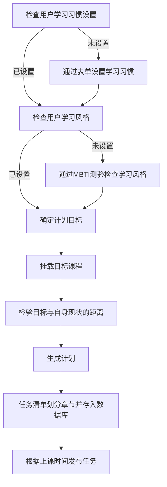

```mermaid
graph TD
    A[检查用户学习习惯设置] -->|未设置| B[通过表单设置学习习惯]
    A -->|已设置| C[检查用户学习风格]
    B --> C
    C -->|未设置| D[通过MBTI测验检查学习风格]
    C -->|已设置| E[确定计划目标]
    D --> E
    E --> F[挂载目标课程]
    F --> G[检验目标与自身现状的距离]
    G --> H[生成计划]
    H --> I[任务清单划分章节并存入数据库]
    I --> J[根据上课时间发布任务]
```